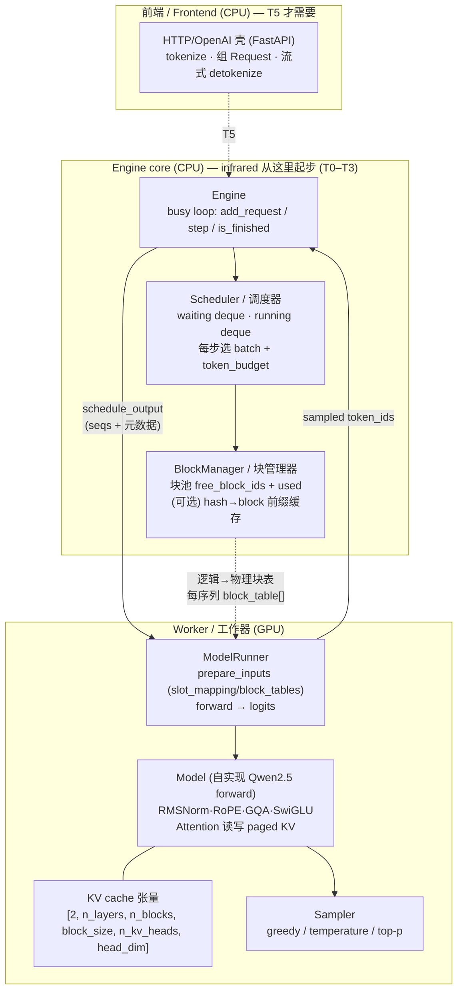
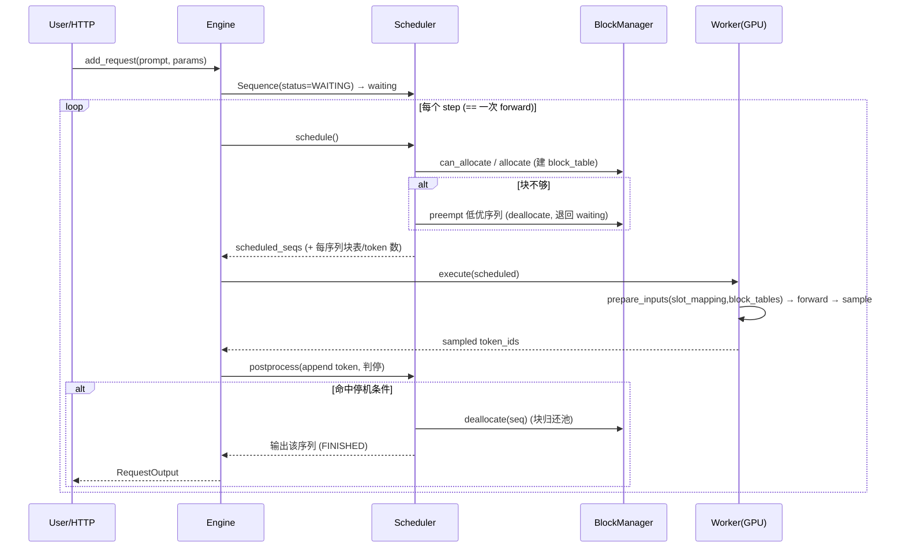

# Research · vLLM v1 + nano-vLLM 架构蓝图 (engine / scheduler / block-manager / worker)

> **Ticket**: R1 · Research (#2), part of the infrared map (#1).
> **Policy (ADR-0004)**: 这是**蓝图学形状**的笔记——描述 vLLM v1 与 nano-vLLM 的**骨架与数据结构**，供 infrared **重写带注释的实现**。**绝不 copy-paste 代码**；下文的伪码是「形状」，非可运行代码。
> **术语**沿用 `CONTEXT.md`（Scheduler/调度器、Block manager/块管理器、Block table/块表、Worker/工作器、Step/步、Sequence…）。
> **Scope note**: infrared 单卡起步、PyTorch eager、只写 Triton kernel（ADR-0001/0003/0005）——文末「infrared 简化取舍」给出 keep/defer 清单。

来源以脚注引用；两大主源是 **vLLM 官方 v1 架构剖析博客**（first-party，vllm.ai）与 **nano-vLLM 公开源码**（GeeeekExplorer/nano-vllm）。

---

## 0. TL;DR — 推荐骨架一句话

一个**单进程忙循环 (busy loop)** 的 `Engine`，其心脏是 `Scheduler`（持 `waiting`/`running` 两个 deque + 一个 `BlockManager`）。每 `step()`：**调度**一批（decode 优先，再塞 (chunked) prefill，受 `token_budget` 与空闲块双重预算约束）→ 交给 `Worker`（持权重 + KV cache 张量 + 采样器）跑**一次 forward + sample** → **postprocess**（追加 token、写块表元数据、判停、回收完成序列的块）。`Scheduler` 只做 CPU 侧「谁进/谁出、块够不够」的决策，`Worker` 只做 GPU 侧「拍平 batch、slot_mapping 写 KV、paged-attn、算 logits、采样」。二者用一个**窄接口** `Worker.execute(scheduler_output) -> sampled_token_ids` 相连——**这条缝 (seam) 就是 T5 拆多进程/多卡的位置**。

---

## 1. 组件图 Component diagram



**engine↔worker 的缝**是全图最重要的一条：`Scheduler` 产出「本步跑哪些序列、每序列几个 token、每序列的块表」，`Worker` 消费它、回吐「每序列 1 个采样 token」。vLLM 把这条缝做成**跨进程 IPC**（见 §6）；nano-vLLM 单卡时把它做成**同进程方法调用**，多卡时才用 shared-memory 广播。infrared 起步时就用**同进程方法调用**。[^blog][^nano-engine]

---

## 2. 各组件职责 Component responsibilities

| 组件 | 职责（做什么） | 明确不做（边界） |
|---|---|---|
| **Engine**（vLLM: `LLMEngine`/`EngineCore`；nano: `LLMEngine`） | 拥有请求生命周期：`add_request` 把 prompt → `Sequence`/`Request` 塞进 waiting；`step()` 驱动 schedule→forward→postprocess；`is_finished` 判全空；聚合并返回完成输出。[^ctx-core][^nano-engine] | 不做块分配、不碰 GPU、不做调度策略细节。 |
| **Scheduler / 调度器**（vLLM: `v1/core/sched/scheduler.py`；nano: `scheduler.py`） | 每步的**准入/退出**决策：维护 `waiting`/`running` 两队列；按 policy（FCFS/priority）与 `token_budget` + 空闲块预算选出本步 batch；调用 `BlockManager` 分配/追加块；块不够时**抢占 (preempt)** 低优序列（回收其块、退回 waiting）；postprocess 里判停、回收完成序列。[^blog][^ctx-sched][^nano-engine] | 不跑 forward、不做张量运算。 |
| **BlockManager / 块管理器**（vLLM: `KVCacheManager` + `BlockPool`；nano: `block_manager.py`） | KV cache 的**分页分配器**：持一个定长块池（free 队列 + used 集合）；`can_allocate/allocate`（prefill 一次要 ⌈tokens/block_size⌉ 块）、`can_append/may_append`（decode 每满一块加一块）、`deallocate`（按 ref_count 归还）；可选**前缀缓存**（块 hash→block_id，命中则复用 + ref_count++）。为每序列填充 `block_table`（逻辑块→物理 block_id）。[^blog][^ctx-kv][^nano-block] | 不知道模型结构、不做 attention。只发/收「块号」。 |
| **Worker / 工作器**（vLLM: `Executor`→`Worker`→`ModelRunner`；nano: `ModelRunner`） | 持模型权重 + KV cache 张量 + sampler；`prepare_inputs`（拍平 batch、算 positions、建 `slot_mapping` 与 `block_tables` 张量、组 attention metadata）；跑 forward（paged-attn kernel）；gather 末位 hidden→logits；采样出 token。启动时**profile 显存**决定块池大小、（可选）capture CUDA graph。[^blog][^nano-runner] | 不决定谁进 batch、不管队列。 |
| **Sequence / Request**（状态载体） | 每请求的状态机对象：token_ids、prompt/completion 计数、`num_computed/cached_tokens`、`num_scheduled_tokens`、`block_table`、采样参数、status。[^ctx-req][^nano-seq] | 纯数据 + 少量派生属性。 |

---

## 3. Step 主循环伪码 The step loop (SHAPE, 重写用)

### 3.1 Engine 外层（连续批的骨架）

```text
# Engine.generate(prompts, params)  —— T1 offline；T5 换成 async 忙循环
for p in prompts: add_request(p, params)          # 全塞进 scheduler.waiting
while not scheduler.is_finished():                 # waiting 与 running 都空才停
    outputs = step()
    for (seq_id, out) in outputs: yield/collect

# Engine.step()  —— 三段式：schedule → forward+sample → postprocess
def step():
    scheduled, is_prefill = scheduler.schedule()   # ① CPU：选 batch + 分配块
    token_ids = worker.execute(scheduled, is_prefill)  # ② GPU：一次 forward + 一次 sample
    scheduler.postprocess(scheduled, token_ids, is_prefill)  # ③ CPU：追加/判停/回收
    return [(s.id, s.completion) for s in scheduled if s.finished]
```

> **要点**：一个 `step` == 模型**一次 forward pass**；调度决策做在 iteration level（每步重评），这正是**连续批 continuous batching** 的定义——序列一完成就在下一步腾位给 waiting。[^ctx-sched][^blog]

### 3.2 Scheduler.schedule()（准入 / 退出判定）

nano-vLLM 的形状（**decode 优先，其次 prefill；每类都受 token_budget + 空闲块双约束**）：[^nano-engine]

```text
def schedule():
    scheduled = []; budget = max_num_batched_tokens

    # ---- 先试 prefill：从 waiting 头部取，尽量塞满 budget ----
    while waiting and len(scheduled) < max_num_seqs:
        seq = waiting[0]
        need = seq.num_tokens - seq.num_cached_tokens        # 还要算多少 prompt token
        if BlockManager.can_allocate(seq) is False: break    # 空闲块不够 → 停
        if need > budget and scheduled: break                # 只有第一条允许 chunked prefill
        BlockManager.allocate(seq)                            # 建 block_table
        seq.num_scheduled_tokens = min(need, budget); budget -= that
        if 整条 prompt 已排完: seq.status = RUNNING; waiting.popleft(); running.append(seq)
        scheduled.append(seq)
    if scheduled: return scheduled, is_prefill=True           # 本步是 prefill 步

    # ---- 没有 prefill 才做 decode：running 每条要 1 个 token ----
    while running and len(scheduled) < max_num_seqs:
        seq = running.popleft()
        while not BlockManager.can_append(seq):               # 块不够
            victim = running.pop() if running else seq
            preempt(victim)                                   # 回收块、退回 waiting 头部
            if victim is seq: break
        else:
            seq.num_scheduled_tokens = 1; seq.is_prefill = False
            BlockManager.may_append(seq)                      # 满一块则加一块
            scheduled.append(seq)
    running.extendleft(reversed(scheduled))                   # 放回队列
    return scheduled, is_prefill=False
```

> **vLLM v1 的差异**：v1 调度器**一步内可混合 prefill+decode**（V0 只能二选一），先处理 running(decode) 再塞 waiting(prefill)，统一走 `allocate_slots`，块不够时对**低优请求做 recompute 抢占**。nano-vLLM 为简单把一步定为「要么全 prefill 要么全 decode」，但保留了「decode 优先 + 第一条可 chunked prefill + 抢占」的核心。infrared 起步可先照 nano 的「二选一」，T4 再演进到 v1 的「混合步」。[^blog][^ctx-sched]

### 3.3 Scheduler.postprocess（判停 + 回收）

```text
def postprocess(seqs, token_ids, is_prefill):
    for seq, tok in zip(seqs, token_ids):
        (可选) BlockManager.hash_blocks(seq)          # 前缀缓存：给刚填满的块登记 hash
        seq.num_cached_tokens += seq.num_scheduled_tokens; seq.num_scheduled_tokens = 0
        if is_prefill and prompt 还没排完: continue    # chunked prefill 中途，不采样
        seq.append_token(tok)
        if (tok == EOS and not ignore_eos) or seq.num_completion == seq.max_tokens:
            seq.status = FINISHED
            BlockManager.deallocate(seq)               # 块归还池
            running.remove(seq)
```

停机条件（v1 完整版）：超长（max_model_len / 自身 max_tokens）、命中 EOS（除非 ignore_eos）、命中 stop_token_ids、出现 stop string（截断并 abort）。[^blog]

---

## 4. 关键数据结构 Key data structures

### 4.1 Sequence / Request 状态机

**状态**（nano-vLLM 三态 vs vLLM v1 全集）：[^nano-seq][^ctx-req]

```text
nano-vLLM SequenceStatus:  WAITING → RUNNING → FINISHED
                              ↑__________|   (被抢占：RUNNING → WAITING，退回队头)

vLLM v1 RequestStatus (IntEnum):
  WAITING, WAITING_FOR_FSM (guided decode), WAITING_FOR_REMOTE_KVS (P/D 分离),
  RUNNING, PREEMPTED,
  FINISHED_STOPPED / FINISHED_LENGTH_CAPPED / FINISHED_ABORTED / FINISHED_ERROR
```

**每序列携带的字段**（infrared 起步最小集，取自 nano `Sequence`）：[^nano-seq]

```text
seq_id, status
token_ids[]          # prompt + 已生成
num_prompt_tokens
num_tokens           # = len(token_ids)，派生 num_completion = num_tokens - num_prompt
num_cached_tokens    # 已在 KV cache 里算好的 token 数（含前缀命中）
num_scheduled_tokens # 本步要算的 token 数（prefill 可 >1，decode = 1）
is_prefill           # 阶段标记
block_table: list[int]   # ★逻辑块 i → 物理 block_id 的映射（见 4.2）
sampling: {temperature, max_tokens, ignore_eos, ...}
# 派生：num_blocks = ceil(num_tokens/block_size)；last_block_num_tokens
```

**状态转移**：`add_request` → WAITING；被 schedule 到且 prompt 排完 → RUNNING；块不够被 preempt → 退回 WAITING（块全释放，重算）；判停 → FINISHED（块归还）。

### 4.2 Block table / 块表（逻辑→物理，= 页表）

```text
序列逻辑视图:  [tok0..tok15][tok16..tok31][tok32..tok47]...   # 每块 block_size 个 token
block_table:  [   7      ][    3       ][   19       ]...   # 物理 block_id（乱序、可复用）
物理 KV 张量:  kv_cache[..., block_id, slot_in_block, kv_head, head_dim]
```

- **块 = 定长 KV 槽位**（vLLM 默认 block_size=16；nano 默认 256）。一序列的 KV 不必连续——块表把逻辑连续映射到**物理乱序块**，消灭外部碎片，这就是 PagedAttention 的地址层。[^blog][^ctx-kv]
- **slot_mapping**（Worker 侧算）：把本步要写的每个 token 映射到「物理槽位 = block_id * block_size + offset」，kernel 据此把新算的 K/V **散写 (scatter)** 进池。decode 时每序列只写 1 个槽；prefill 写一段。[^nano-runner][^nano-attn]
- **block_tables 张量**（Worker 侧）：把各序列变长 `block_table` **右 pad 成矩阵**喂给 paged-attn kernel，让它 gather 出每序列的历史 KV。[^nano-runner]

### 4.3 Block 池 & 前缀缓存

nano-vLLM `Block` / `BlockManager` 形状：[^nano-block]

```text
Block: { block_id, ref_count, hash=-1, token_ids[] }
BlockManager:
  blocks: list[Block]            # 全部物理块
  free_block_ids: deque[int]     # 空闲块 FIFO
  used_block_ids: set[int]
  hash_to_block_id: dict[hash,int]   # ★前缀缓存索引（满块才登记）

  can_allocate(seq) -> 命中的缓存块数 or -1(块不够)   # 顺带算前缀命中
  allocate(seq, num_cached): 复用命中块(ref++) + 为其余新块 popleft
  can_append(seq): 空闲块 >= (再加 1 个 token 是否跨块)
  may_append(seq): 满一块则再要一块
  deallocate(seq): 逆序 ref--，归零则回 free 队列
```

vLLM v1 对应物是 `KVCacheBlock { block_id, block_hash, ref_cnt, prev/next_free }` 组成的**双向链表 free queue** + `BlockPool`；分配走 `allocate_slots`（算需几块→查够不够→从池头取→写 `req_to_blocks`）。`ref_cnt` 让多个请求**共享**同一前缀块。[^blog][^ctx-kvblock]

### 4.4 waiting / running 队列

- 两个 `deque[Sequence]`（nano）。waiting：尚未准入或被抢占退回；running：已在批内解码。[^nano-engine]
- policy：FCFS = append/popleft；priority = 堆。抢占按逆序 pop running 尾部（低优），保证恢复时 FIFO。[^blog][^ctx-sched]

---

## 5. Worker 侧 forward 的形状（GPU）

`Worker.execute(seqs, is_prefill)` 五步（vLLM 与 nano 一致）：[^blog][^nano-runner]

```text
1. update_states   剪掉已完成序列；刷新每序列块表元数据
2. prepare_inputs  CPU→GPU 拷贝；算 positions；建 slot_mapping / block_tables 张量；组 attn metadata
3. forward         跑模型；★所有序列拍平拼成一条「超序列」，用 cu_seqlens/positions
                   让每序列只 attend 自己 → 无需右 pad 即支持连续批
4. gather logits   取每序列末位 hidden，算 logits
5. sample          按采样配置出 token（greedy/temp/top-p...）
```

- **prefill vs decode 两条路**：prefill 用 varlen attention（`cu_seqlens_q/k`）；decode 每序列 1 query token，用 paged KV + `context_lens` + `block_tables`。nano 用 `flash_attn` 库 + 一个 **Triton `store_kvcache` kernel** 把 K/V 按 slot_mapping 写进池。[^nano-attn]
- **KV cache 张量布局**（nano）：`[2, n_layers, n_blocks, block_size, n_kv_heads, head_dim]`，每 attention 层持 `k_cache/v_cache` 视图。块数在启动时**profile 显存**算出：`(总显存*util - 已用 - peak + current) / 每块字节`。[^nano-runner]
- **执行模式**：eager（PyTorch 直跑）或 CUDA graph replay（非 enforce_eager 时按 batch size 预捕获）。[^blog][^nano-runner]

---

## 6. Engine ↔ Worker 拆分 The split

| | vLLM v1 | nano-vLLM | infrared 起步建议 |
|---|---|---|---|
| 前端/核 | 前端进程（tokenize/detokenize/流式）与 `EngineCore` 进程分离，用 ZMQ/msgpack IPC，CPU 与 GPU 重叠。[^blog][^ctx-inproc] | 无独立前端；`LLMEngine` 直接串起来 | **同进程**：Engine 直接调 Worker 方法（等价 vLLM `InprocClient`/`UniprocExecutor`）[^ctx-inproc] |
| 单卡执行器 | `UniprocExecutor` → 1 个 `Worker` → `ModelRunner` | rank-0 `ModelRunner` 就在主进程内被 `call("run", …)` | 同 nano：Worker 就是一个对象 |
| 多卡 (TP) | `MultiProcExecutor`：每 GPU 一 worker 进程，collective RPC 广播 | rank>0 起 `spawn` 子进程，主进程用 **SharedMemory + Event** 广播方法名+参数，子进程 `loop()` 读取执行 | **defer 到 T6**；先把接口做窄，留好这条缝 |
| DP | 每 data-parallel rank 一个 `EngineCore` | — | 不做 |

> **设计要点**：无论进程怎么摆，缝的**契约**恒定 = `execute(scheduler_output) -> per-seq sampled token`。infrared 起步做同进程调用，但**接口按「可序列化的 scheduler_output」设计**，这样 T6 拆进程/多卡时不改调度器与块管理器。[^blog]

---

## 7. 请求生命周期 Request lifecycle



阶段：**入队** (WAITING) → **准入** (prefill 排完→RUNNING) → **解码循环** (每步 1 token，KV 追加，必要时被抢占回 WAITING) → **判停** (FINISHED，块回收) → **返回**。[^blog][^nano-engine]

---

## 8. infrared 简化取舍 Simplifications（given ADR-0001/0003/0005）

我们的约束：**不手写 CUDA C++（只 Triton）、单卡起步、PyTorch eager、Qwen2.5、0.5B 开发 / 7B 压测、HF 仅加载权重**。据此把上面骨架裁成阶梯 T0–T6。

### ✅ Keep（从一开始就要，学习价值核心）
- **三段式 `step()`**（schedule→forward→postprocess）与 **Engine/Scheduler/BlockManager/Worker 四件套包结构**——这是「读 infrared ≈ 读讲解版 vLLM 骨架」的价值所在（ADR-0004）。
- **waiting/running 两队列 + 连续批**（T2 的核心机制）。先用 nano 的「一步全 prefill 或全 decode + decode 优先」最小形态。
- **Sequence 状态机**（WAITING/RUNNING/FINISHED 三态起步）+ **block_table 逻辑→物理映射**（T3 核心）。
- **BlockManager 块池**（free deque + used set + ref_count + can_allocate/append/deallocate）。这是 T3 亲手造的机制。
- **slot_mapping / block_tables 张量**契约——即使 T0 用最朴素的 gather，也按这个形状传，方便 T4 换 Triton paged-attn kernel。
- **profile 显存定块数** + **enforce_eager 优先**（先正确、先能测）。
- **窄的 engine↔worker 接口**（同进程方法调用，但参数可序列化），为 T6 拆多进程留缝。

### 🟡 Defer / 简化（后续阶梯或直接砍）
| 项 | 处置 | 理由 / 归档到 |
|---|---|---|
| 前端进程分离 + ZMQ IPC | **砍**，同进程直调（`InprocClient` 式） | 单卡单请求起步；T5 才要 async HTTP 壳 |
| MultiProc / TP / DP / PP | **defer 到 T6**，只把接口留窄 | ADR-0005 单卡；TP 临时租 2 卡验证 |
| CUDA graph capture | **defer 到 T4** | 先 eager 保正确 + 可测；graph 是延迟优化 |
| flash_attn 库依赖 | **不用**；先朴素 PyTorch attention，**T4 自写 Triton paged-attn kernel** | ADR-0003：attention/KV 路径要**自己造**；flash_attn 属「拿现成 engine 件」范畴的替代——改为 Triton 自研正是学习点 |
| 前缀缓存 (hash_to_block_id) | **defer 到 T4** | 先把裸块池 + 块表跑通再上缓存 |
| Chunked prefill | **defer 到 T4**（先允许「第一条可 chunk」的最简形，或整 prompt 一次 prefill） | 单卡短 prompt 起步影响小 |
| 混合 prefill+decode 单步 (v1) | **defer**；起步用 nano「二选一」步 | 更易写对；T4 再演进到 v1 混合步 |
| 抢占/preemption | **T2/T3 就要**（块不够必须能退序列），但只做 **recompute 抢占**（重算），不做 swap-to-CPU | swap 复杂且收益边际；recompute 够学连续批 |
| Guided decode / spec decode / P/D 分离 / LoRA / 量化 | **砍到 T6+ backlog** | spec 里的 WAITING_FOR_FSM / WAITING_FOR_REMOTE_KVS 状态不引入 |
| block_size | 用**较小值（如 16，对齐 vLLM 默认）** 而非 nano 的 256 | 单卡小模型下更细粒度、碎片更少、演示块表更直观 |

### 建议包结构（scaffold 的直接输入）
```
infrared/
  engine/
    engine.py        # Engine: add_request / step / generate / is_finished
    scheduler.py     # Scheduler: waiting/running deque, schedule(), preempt(), postprocess()
    block_manager.py # BlockManager + Block: 块池, block_table 分配/回收, (T4) 前缀缓存
    sequence.py      # Sequence + SequenceStatus 状态机
  worker/
    model_runner.py  # prepare_inputs(slot_mapping/block_tables), forward, sample
    sampler.py       # greedy / temperature / top-p
  layers/
    attention.py     # T0 朴素 → T4 Triton paged-attn kernel + store_kvcache
    (rmsnorm/rope/gqa/swiglu ...)  # 自实现 Qwen2.5 forward
  models/qwen2.py    # 组装 forward，HF safetensors 只加载权重
  config.py          # block_size, max_num_seqs, max_num_batched_tokens, gpu_mem_util ...
```
这直接决定 **T2（连续批调度器）** 落在 `engine/scheduler.py`、**T3（paged KV 块管理）** 落在 `engine/block_manager.py` + `worker/model_runner.py` 的 slot_mapping/block_tables，与 issue #2「Why」一致。

---

## 9. 三/四条最重要的设计决策（surfaced）

1. **调度器是 CPU 侧纯决策、Worker 是 GPU 侧纯执行，二者只靠一条窄缝 (scheduler_output) 相连**——这条缝的稳定契约让「同进程起步、T6 拆多进程」不动调度/块管理代码。这是整个骨架最关键的可扩展点。
2. **块表 (block_table) 是逻辑→物理的页表，slot_mapping 是「本步写哪些物理槽」的散写索引**——把这两个数据结构的形状先定死（即使 T0 用朴素 attention），T3/T4 才能无痛换 paged-attn kernel。
3. **连续批 = iteration-level 调度 + 拍平 batch (无右 pad) + 序列完成即腾位**；先用 nano 的「一步二选一 (全 prefill 或全 decode) + decode 优先 + 第一条可 chunk」最小形态，把 v1 的「混合步」留到 T4。
4. **块不够时用 recompute 抢占（不做 swap）**：preempt = 释放块 + 退回 waiting 队头 + 重算。这是连续批在显存压力下不崩的关键，也是学习点，但砍掉 swap 复杂度。

---

## Sources（来源）

**主源 (primary)**
- [^blog]: vLLM 官方博客 · Aleksa Gordic, *"Inside vLLM: Anatomy of a High-Throughput LLM Inference System"* (2025-09-05, 基于 commit `42172ad`)。https://vllm.ai/blog/2025-09-05-anatomy-of-vllm — 覆盖 engine 构造、step 三段、scheduler（decode 优先 + allocate_slots + 抢占）、block 池 free_block_queue、Executor→Worker→ModelRunner、forward 五步、请求生命周期与停机条件、Uniproc→MultiProc。
- [^nano-engine]: nano-vLLM 源码 `nanovllm/engine/llm_engine.py`（`LLMEngine.step/generate/add_request`）。https://github.com/GeeeekExplorer/nano-vllm
- [^nano-block]: nano-vLLM `nanovllm/engine/block_manager.py`（`Block`, `BlockManager.can_allocate/allocate/can_append/may_append/deallocate/hash_blocks`）。
- [^nano-seq]: nano-vLLM `nanovllm/engine/sequence.py`（`SequenceStatus`, `Sequence` 字段与派生属性）。
- [^nano-runner]: nano-vLLM `nanovllm/engine/model_runner.py`（`prepare_prefill/prepare_decode` 建 slot_mapping/block_tables、`allocate_kv_cache` profile 显存、CUDA graph、TP shared-memory 广播）。
- [^nano-attn]: nano-vLLM `nanovllm/layers/attention.py` + `nanovllm/utils/context.py`（Triton `store_kvcache` kernel、prefill varlen / decode paged 两路、Context 元数据）。

**Context7 核实 (ADR-0004 铁律)** — `/websites/vllm_ai_en_stable`
- [^ctx-sched]: `docs.vllm.ai/.../v1/core/sched/scheduler` & `.../interface` — `schedule() -> SchedulerOutput`，iteration-level、`{req_id: num_tokens}`、token_budget、chunked prefill 阈值。
- [^ctx-core]: `docs.vllm.ai/.../v1/engine/core` — `EngineCore.run_busy_loop`（poll input queue → step）、`_process_engine_step`。
- [^ctx-inproc]: `docs.vllm.ai/.../v1/engine/core_client` — `InprocClient`（同进程 add_request/step，无 busy loop）。
- [^ctx-kv]: `docs.vllm.ai/.../v1/core/kv_cache_manager` — 块分配三段（free skipped → prefix → new blocks）、`block_pool.get_num_free_blocks`。
- [^ctx-kvblock]: `docs.vllm.ai/en/stable/design/prefix_caching` — `KVCacheBlock { block_id, block_hash, ref_cnt, prev/next_free }` 双向链表 free queue。
- [^ctx-req]: `docs.vllm.ai/.../v1/request` — `RequestStatus` IntEnum（WAITING / WAITING_FOR_FSM / WAITING_FOR_REMOTE_KVS / RUNNING / PREEMPTED / FINISHED_*）。

**约束依据**: `docs/spec/0001-infrared-engine.md`, `docs/adr/0001,0003,0004,0005`, `CONTEXT.md`。

---

_↩ Back to tracking issue: [infrared#2 — R1 · Research: vLLM v1 + nano-vLLM 架构蓝图](https://github.com/xiangzhang-coding/infrared/issues/2)_
